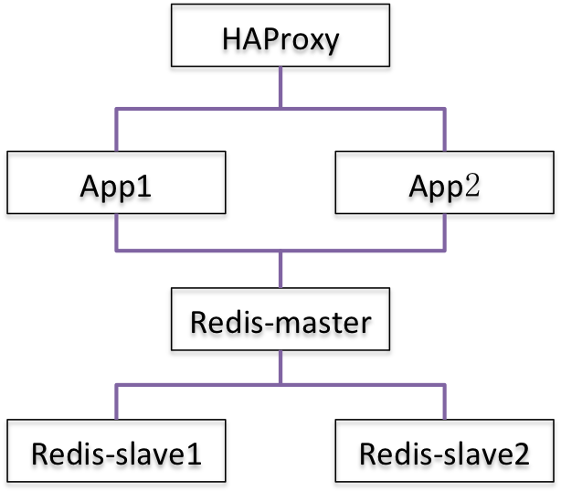

# 用docker搭建全栈式应用 (二）—— 自动化构建
## 简介
在[上一篇][previous blog]中, 我们已经较为详细的描述如何基于docker，搭建一套全栈式应用。web端采用Django，并使用HaProxy作为负载均衡。数据库采用redis，并使用master-slave的部署方式。前文基于从官方的docker registry的images，讲述了一步步如何启动配置各项服务。但是在实际部署中，不可能全部手动的完成这些事情，本文将讲述基于Dockerfile，来自动生成所需的Docker image，并将讲述基于构建的image如何启动服务。

在前篇博文中，如何在docker中一步步部署服务。基本上主要包括了几个大的步骤：将配置拷贝到相应目录，同时做好修改；基于image启动docker container，同时挂载配置的目录；在container中启动服务。这样的部署方式有几个问题：
* 全部手动操作，每次多事重复劳动
* 需要手动进入container中启动服务，部署非常耗时
* 配置需要在外面修改，极大地违背了docker隔离性的设计理念

那么，如何解决这些问题呢？这里将引入本文将要讲述的Docker的自动化构建机制。所谓自动化构建，其实主要指的是基于Dockerfile的构建方式。利用Dockerfile，我们可以非常方便的构建一个独立完整的应用，同时集成一系列部署时候的操作，使得自动化的部署得以实现。Dockerfile是一个文本文件，里面记录了一系列的命令和操作，给出了一个docker image组成的完整定义。关于Dockerfile的详细介绍，请务必参考[官方的文档](https://docs.docker.com/engine/reference/builder/)，千万不要用X度，官方的文档其实讲述的非常清楚，而且基本上就一页就讲完了。

ok, 下面咱们就开始讲述Docker的自动化构建部分。讲述之前，这里还是引入一下前文中的应用架构图，方便讲述及阅读。

<div style="text-align:center">
    
</div>

## Images构建
### Redis-master构建
在[上一篇][previous blog]中，redis-master的构建主要包括如下步骤：

* 获取redis image

    ```
    # docker pull redis
    ```

* 启动redis master container

    ```
    # docker run -it --name redis-master -v `pwd`/master:/data redis /bin/bash
    ```

* 配置redis master

    主要是修改配置文件`master/redis.conf`

* 在container中启动redis service

全部手动的操作比较繁琐，使用Dockerfile将可以实现自动化构建。这里先将构建redis-master的Dockerfile先列出，然后在详细介绍。
```
FROM redis
COPY ./redis.conf /data/
CMD redis-server /data/redis.conf
```

此Dockerfile主要采用了三个命令。
* `FROM redis`

    对应于手动操作中的`docker pull redis`，表示构建此image是基于官方docker registry中的redis image。Docker看到这个指令之后会首先从本地的cache中查找是否已经存在，如果存在就直接使用本地cache，如果不存在将自动的从docker registry下载。

* `COPY ./redis.conf /data/`

    COPY命令将指定的文件拷贝到docker image中。这里需要先配置好`redis.conf`，这点与手动的不一样，手动的可以先配置好，也可以启动container之后再行配置，但是在Dockerfile中，由于将构建新的docker image，通常来讲里面得包含必须的文件。所以可以先配置好，然后直接打包到所要构建的image中。

* `CMD redis-server /data/redis.conf`

    `CMD`命令指定了基于此image启动的container运行时将启动什么服务命令。这里指定了将启动服务命令`redis-server /data/redis.conf`。


接下来，咱们来基于这个Dockerfile来实际操作一下，看看具体的构建过程是如何进行的。

* 为了节省时间，这里先假设依赖的image已经在本地cache中

    ```
    # docker images
    REPOSITORY          TAG                 IMAGE ID            CREATED             VIRTUAL SIZE
    redis               latest              84dbf5edc313        2 weeks ago         184.8 MB
    ```
    如果本地没有也没关系，docker的构建工具会自动下载。

* 构建image

    ```
    # ls
    Dockerfile  redis.conf
    # docker build -t redis-master .
    Sending build context to Docker daemon 48.13 kB
    Step 1 : FROM redis
     ---> 84dbf5edc313
    Step 2 : COPY ./redis.conf /data/
     ---> 3cafd319458b
    Removing intermediate container c7c2fb33b52b
    Step 3 : CMD redis-server /data/redis.conf
     ---> Running in 30c859175110
     ---> 8c7a0742a542
    Removing intermediate container 30c859175110
    Successfully built 8c7a0742a542
    ```

    构建的命令为`docker build -t redis-master .`，其中`-t`指定生成的image叫什么名字；`.`指的是在当前目录下执行，docker将在当前目录查找名为`Dockerfile`的文件，然后基于它进行构建。构建成功之后再看看本地的cache：
    ```
    # docker images
    REPOSITORY          TAG                 IMAGE ID            CREATED             VIRTUAL SIZE
    redis-master        latest              8c7a0742a542        3 minutes ago       184.9 MB
    redis               latest              84dbf5edc313        2 weeks ago         184.8 MB
    ```
    可以看到，本地的cache中增加了一个名为`redis-master`的image。

* 启动container

    ```
    # docker run -d --name redis-master redis-master
    1ab87eaefaccc47f91063d27db124d5573932439a46ff15204580b8cbbf3b91a
    ```
    其中，`-d`是让container运行在后台，`--name`则是指定container的名字。成功运行后，打印出来的就是container的ID。我们来看下当前运行的状态：
    ```
    # docker ps -a
    CONTAINER ID        IMAGE               COMMAND                  CREATED             STATUS                     PORTS               NAMES
    1ab87eaefacc        redis-master        "docker-entrypoint.sh"   2 minutes ago       Exited (0) 2 minutes ago                       redis-master
    ```

    我们可以看到，非常奇怪的是container虽然成功的创建出来了，但是状态却是`Exited`，似乎并没有成功的运行起来，其实准确来讲应该是自动退出了。一般情况下，如果一个container没有按照预想运行起来，咱们还是需要稍微的调试一番，这里最为常用的调试手段就是查看container运行的日志：
    ```
    # docker logs redis-master

    ```
    我们发现，并没有任何的日志输出。这是怎么回事呢？其实对于container为什么会自动退出，可能的原因会有非常多。但是，最为基本的一点必须需要清楚，那就是container的生命周期。container在创建并启动之后会自动运行Dockerfile中指定的`CMD`，然后一直运行直到`CMD`命令退出，container也会退出，*请注意*，***命令必须一直运行在前台***，否则container将视为命令自动退出，也就跟着退出了。重新查看我们这里启动的命令`redis-server /data/redis.conf`，打开其中的配置文件可以发现其中一行配置如下：
    ```sh
    daemonize yes
    ```
    其意思就是指定redis-server以后台daemon的形式运行。这样我们就可以解释清楚了，当前的配置文件是的redis-server运行在后台，那么container肯定会自动退出了。

    那么问题来了，如何解决呢？很自然的我们会想到，修改配置让其运行在前台就好了，确实如此，修改如下：
    ```
    daemonize no
    ```
    我们在container外面修改了配置，很明显不会对已经存在的container有任何影响。当前的container是由当前的image生成的，因此，为了能够是的改动生效，咱们得重新构建image，并重新启动：
    * 首先，删除当前的container

        ```
        # docker rm redis-master
        redis-master
        ```

    * 重新构建image

        ```
		# docker build -t redis-master .
		Sending build context to Docker daemon 48.13 kB
		Step 1 : FROM redis
		 ---> 84dbf5edc313
		Step 2 : COPY ./redis.conf /data/
		 ---> 82030daeddd8
		Removing intermediate container 22b9f260a3af
		Step 3 : CMD redis-server /data/redis.conf
		 ---> Running in 8e90495733d8
		 ---> 9893c50d215a
		Removing intermediate container 8e90495733d8
		Successfully built 9893c50d215a
        ```

    * 启动container

        ```
        # docker run -d --name redis-master redis-master
        803073f7771f2f20e887423b0bee6823c0247a54c971db38dec675743ba2747c
        ```

    * 检查状态

        ```
        # docker ps -a
        CONTAINER ID        IMAGE               COMMAND                  CREATED             STATUS              PORTS               NAMES
        803073f7771f        redis-master        "docker-entrypoint.sh"   40 seconds ago      Up 37 seconds       6379/tcp            redis-master
        ```
        可以看到，container成功运行起来了。

    修改配置，将service运行在前台确实是一种常用的解决办法，但是在有些情况下却并不适用，比如入股需要同时启动多个service，或者需要对service进行监控以确保在service crash的时候能够自动重启等。对于这些场景，可以考虑采用另一种解决方案：采用supervisord管理服务。关于如何使用supervisord，请参照[官方的教程](https://docs.docker.com/engine/admin/using_supervisord/)。

* 简单测试

    container虽然成功运行起来了，但还是需要简单的测试一下是否服务运行正常，这里咱们需要在container中启动一下`bash`调试一下：
    * 打开bash

        ```
        # docker exec -it redis-master bash
        root@803073f7771f:/data#
        ```
        `exec`命令将在container中运行指定的命令，`-it`其实是`-i -t`的缩写，`-i`意思是以交互的方式运行，`-t`指的是要attach到指定的container，这里运行的命令是bash。

    * 运行redis cli

        ```
        root@803073f7771f:/data# redis-cli
        127.0.0.1:6379> set master test
        OK
        127.0.0.1:6379> get master
        "test"
        ```
        可以看到，能够正常的设置并获取，说明运行正常。

至此，redis-master已经构建并运行成功。接下来我们将讲述其它服务是如何构建的。

### redis-slave1构建
在上一节中，我们已经对基于Dockerfile的构建方式有了较为详细的介绍，这里将主要讲述不一样的地方。
* 编写Dockerfile

    ```
    FROM redis
    COPY ./redis.conf /data/
    CMD redis-server /data/redis.conf
    ```
    这里基本上与redis-master一模一样。

* 修改配置

    配置基本上跟[上一篇][previous blog]中一样，唯一需要修改的跟redis-master一样，redis-server必须运行在前台：
    ```
    daemonize no
    ```

* 构建image

    ```
	# docker build -t redis-slave1 .
	Sending build context to Docker daemon 48.13 kB
	Step 1 : FROM redis
	 ---> 84dbf5edc313
	Step 2 : COPY ./redis.conf /data/
	 ---> 98ae8ed20a4d
	Removing intermediate container 0c860e887400
	Step 3 : CMD redis-server /data/redis.conf
	 ---> Running in d0f9370ca3e9
	 ---> 8804bb83f02e
	Removing intermediate container d0f9370ca3e9
	Successfully built 8804bb83f02e
    ```
    完成之后，本地cache如下：
    ```
    # docker images
    REPOSITORY          TAG                 IMAGE ID            CREATED              VIRTUAL SIZE
    redis-slave1        latest              8804bb83f02e        About a minute ago   184.9 MB
    redis-master        latest              9893c50d215a        43 minutes ago       184.9 MB
    redis               latest              84dbf5edc313        2 weeks ago          184.8 MB
    ```
    可以看出增加了一个名为redis-slave1的image。

* 启动container

    ```
    # docker run -d --name redis-slave1 --link redis-master:master redis-slave1
    570c03cdb20cb34a688f9988b2283b42ee2b237986bb8713cc1ca2328b3e7a6b
    ```
    这里特别注意的是，与[上一篇][previous blog]中一样，必须将redis-master的container link起来。这里可以简单对比一下跟[上一篇][previous blog]中运行container命令的区别，在上一篇中运行的命令为：
    ```
    # docker run -it --name redis-slave1 --link redis-master:master -v `pwd`/slave1:/data redis /bin/bash
    ```
    可以看出，有了自动构建的image，就不再需要映射本地的配置目录了，也不需要直接运行一个交互式的bash了，container可以直接以`-d`的形式运行在后台。

    检查一下container的状态：
    ```
    # docker ps -a -f name=redis-slave1
    CONTAINER ID        IMAGE               COMMAND                  CREATED             STATUS              PORTS               NAMES
    570c03cdb20c        redis-slave1        "docker-entrypoint.sh"   4 minutes ago       Up 4 minutes        6379/tcp            redis-slave1
    ```
    请注意到，这里检查状态的命令与之前不通，采用了`-f`参数。`-f`参数表示使用过滤器，这里的过滤器为`name=redis-slave1`，意思为只显示名字中包括`redis-slave1`的所有containers，这里就会直接显示刚刚创建的`redis-slave1`的container。

* 简单测试

    同样，需要对启动的服务进行简单的测试。redis-slave1由于是redis-master的一个slave，因此，我们刚刚在master中设置的`master`值，在redis-slave1中也应该可以看到，我们来测试一下：
    ```
    # docker exec -it redis-slave1 /bin/bash
    root@570c03cdb20c:/data# redis-cli
    127.0.0.1:6379> get master
    "test"
    127.0.0.1:6379>
    ```
    与之前一样，我们也启动一个交互式的bash用来测试，这里可以看到，在redis-slave1，我们并没有做任何值得设置，却直接获取到了redis-master中设置的`master`值。可见，redis-slave1工作正常。


### redis-slave2构建

redis-slave2的构建与redis-slave1除了名字不同之外基本上一模一样，这里讲不再赘述。

### app1的构建

[previous blog]: ../full-stack-demo/README.md
